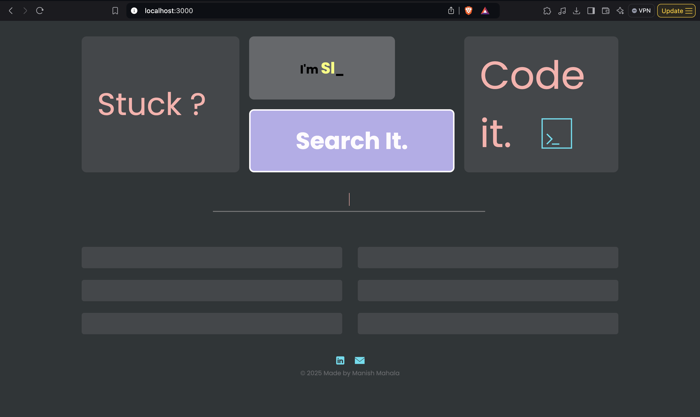
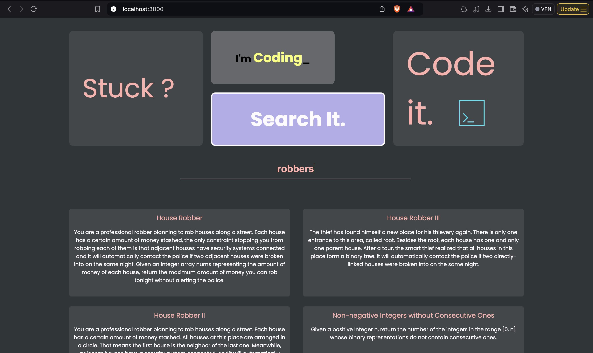
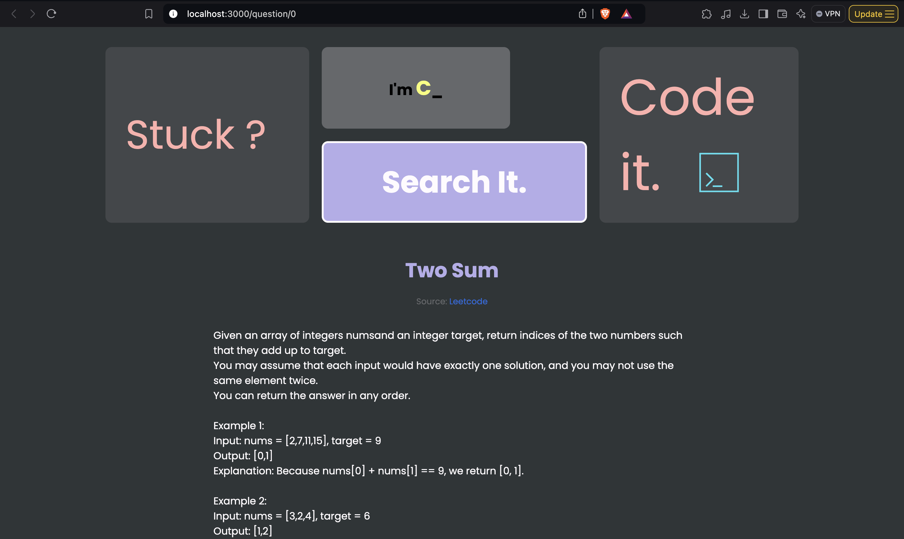

# Codeit

## Project Description
Code-It is a search engine designed to help users find coding problems. Using the TF-IDF (Term Frequency-Inverse Document Frequency) algorithm, Code-It processes user queries and retrieves the most relevant coding problems. Its intuitive interface ensures users can easily navigate and find the coding challenges they need.

## Author
- [@manishmahala](https://github.com/manishmahala)

## Tech Stack
- **Client:** EJS
- **Server:** Node, Express

## Demo
### Home Page


### Search Results


### Detailed View



## Installation Instructions
1. Clone the repository:
   ```bash
   git clone https://github.com/manishmahala/Codeit.git

2. Navigate to the project directory:
   ```bash
     cd codeit
3. Install the dependencies:
   ```bash
   npm install
4. Run the application:
   ```bash
   node app.js

## Usage Instructions
- Open your browser and navigate to http://localhost:3000.
- Use the search bar to input your coding problem queries.
- Browse through the search results to find relevant coding problems.

## Future scope
- We can add a cache layer before the user query hits the server to reduce the
response time.
- We can look into something known as Sharding (DBMS Concept) which allows
us to perform searches over different sets of data concurrently.
- In future we can add a feature to add new questions to our database and then in
order to update the indexes (TF-IDF values) we can run a Cron Job which runs
every 24 hours to produce the updated index files.


## Contribution Guidelines
I welcome contributions to Code-It! If you have any ideas, feel free to fork the repository and submit a pull request. Please make sure your contributions align with the project's goals and follow the established coding standards.


